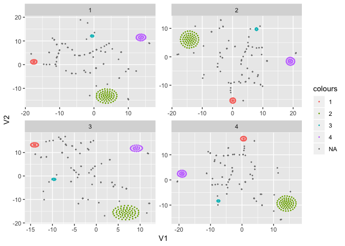
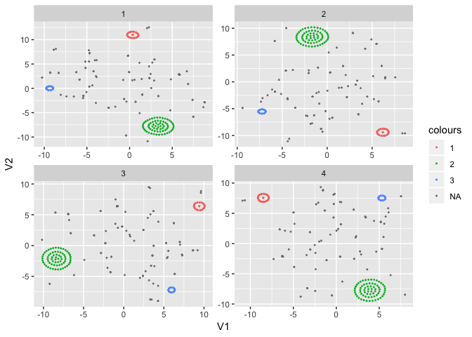
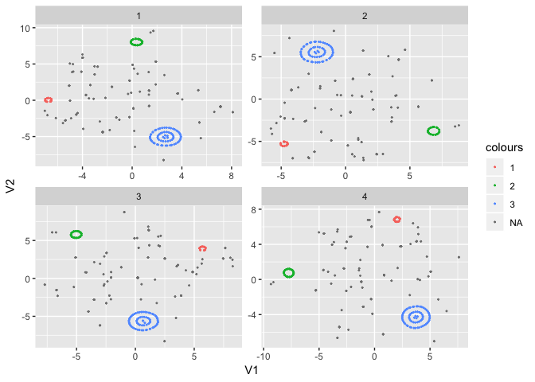
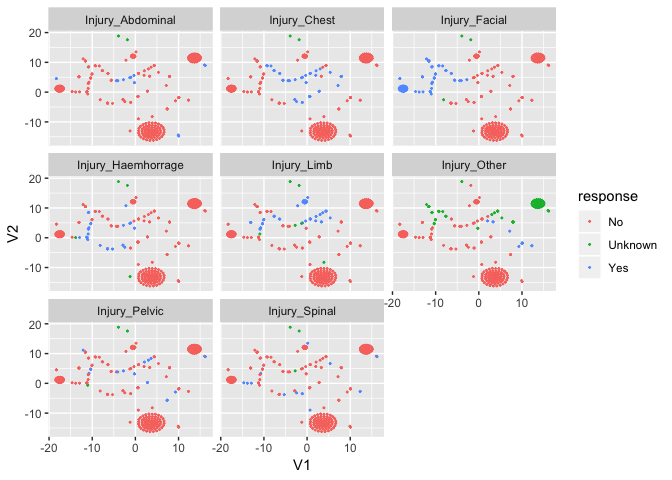
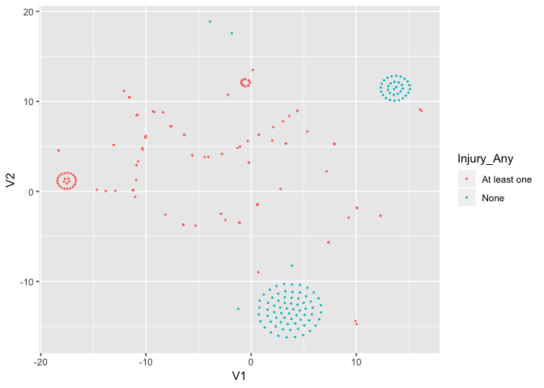
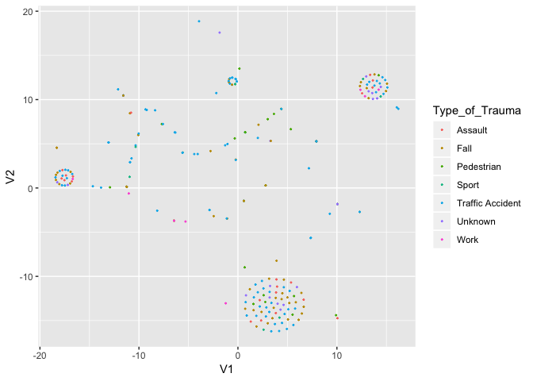
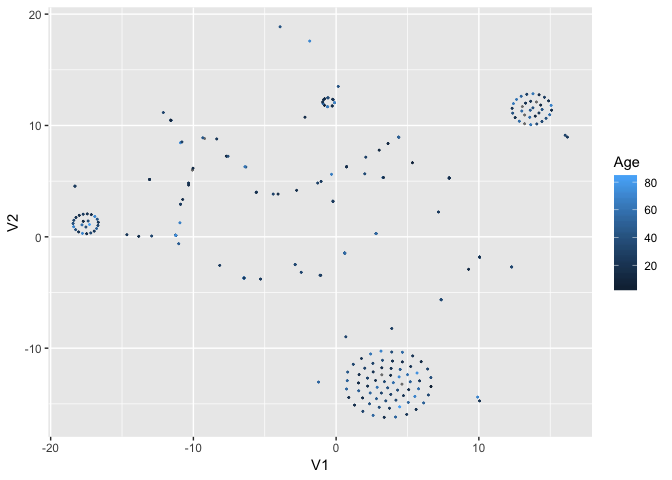
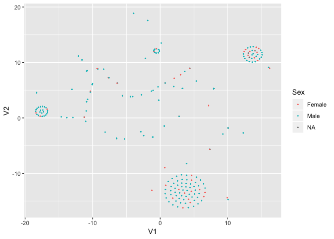

BrainIT Datathon Report
================
Elsie Horne
12/12/2018

Setup and load data
-------------------

``` r
library(tidyverse)
```

    ## ── Attaching packages ─────────────────────────────────────────────────────────────────────────────── tidyverse 1.2.1 ──

    ## ✔ ggplot2 3.1.0     ✔ purrr   0.2.5
    ## ✔ tibble  1.4.2     ✔ dplyr   0.7.8
    ## ✔ tidyr   0.8.2     ✔ stringr 1.3.1
    ## ✔ readr   1.2.1     ✔ forcats 0.3.0

    ## ── Conflicts ────────────────────────────────────────────────────────────────────────────────── tidyverse_conflicts() ──
    ## ✖ dplyr::filter() masks stats::filter()
    ## ✖ dplyr::lag()    masks stats::lag()

``` r
library(tsne)
```

``` r
BIT_Demographic <- readRDS("~/OneDrive - University of Edinburgh/BrainIT/BIT_DATA_2005/BIT_Demographic.rds")
```

Select and clean variabels of interest
--------------------------------------

Create a new dataset with just the 8 injury variables. Drop `Injury_Other_Spec` as this contains free text.

``` r
injury <- BIT_Demographic %>%
  select(Patient_Id, starts_with("Injury")) %>%
  select(-Injury_Other_Spec)
```

View the levels of each variable.

``` r
lapply(injury[-1], table, useNA = "always")
```

    ## $Injury_Haemhorrage
    ## 
    ##      No Unknown     Yes    <NA> 
    ##     223       2      34       2 
    ## 
    ## $Injury_Chest
    ## 
    ##   No  Yes <NA> 
    ##  211   48    2 
    ## 
    ## $Injury_Limb
    ## 
    ##      No Unknown     Yes    <NA> 
    ##     206       3      49       3 
    ## 
    ## $Injury_Spinal
    ## 
    ##      No Unknown     Yes    <NA> 
    ##     244       1      14       2 
    ## 
    ## $Injury_Facial
    ## 
    ##   No  Yes <NA> 
    ##  187   71    3 
    ## 
    ## $Injury_Abdominal
    ## 
    ##      No Unknown     Yes    <NA> 
    ##     244       1      14       2 
    ## 
    ## $Injury_Pelvic
    ## 
    ##      No Unknown     Yes    <NA> 
    ##     240       1      18       2 
    ## 
    ## $Injury_Other
    ## 
    ##   No  Yes <NA> 
    ##  178   14   69

Many variables have a level for both `NA` and `Unknown`. Recode all `NA`'s to `Unknown`.

``` r
injury <- injury %>%
  mutate_if(is.factor, 
            function(x) 
              factor(if_else(is.na(x), 
                             "Unknown", 
                             as.character(x)), 
                     ordered = FALSE)
            )
```

Dissimilarity matrix
--------------------

The next step is to calculate the dissimilarity matrix. For a dataset with `p` variabels and `n` observations (`n` patients in this case), the dissimilarity matrix is an `nxn` matrix, where the entry in the `i`th column and `j`th row is the dissimilarity between patient `i` and patient `j`. For our `injury` data, a small number would suggest that patient `i` and patient `j` have similar injuries, while a large number would suggest they have different injuries.

There are many different dissimilarity metrics. The choice of metric both depends on the type of variables (i.e. continuous, categorical, binary etc.) and the context of the problem. The most common metric is the Euclidean distance. However, as this is used to calculate the distance between continuous variables, it is not suitable for our categorical dataset.

Each variable in our dataset has three levels: `Yes`, `No` and `Unknown`. In our custom dissimilarity matrix, we calculate the dissimilarity between two patients on one variable as 0 if they are in the same category, and 1 if they are in different categories. For each pair of patients, the dissimilairities are summed over all variables, and divided by the total number of variables (8 in this case).

``` r
# create matrix of only injury variables
x <- injury %>% 
  select(-Patient_Id) %>%
  mutate_all(as.integer) %>%
  as.matrix()
# create function for calculating dissimilarities between pairs of patients
my_dist <- function(x) {
  function(i, j) {
    round(1 - sum(x[i,]==x[j,])/ncol(x), 3)
  }
}
dist_x <- my_dist(x)
# create matrix of dissimilarities
d <- sapply(1:nrow(x), 
            function(j) sapply(1:nrow(x), dist_x, j)
            )
# convert matrix to object of class "dist"
d <- as.dist(d)
```

t-SNE
-----

Run t-SNE four times over three different perplexity parameters (`15`, `30`, `45`). This is repeated over four different starting values to check the sensitivity of the results. These datasets are saved in the list `tsne_results`.

``` r
# DO NOT RUN, takes a few minutes, data can be loaded below
# my_tsne <- function(perp, dist, seed) {
#   set.seed(seed)
#   tsne(X = dist, perplexity = perp)
# }
perplexities <- c(15, 30, 45)
seeds <- c(79648, 26796, 40002, 87453)
# tsne_results <- lapply(perplexities, function(x) lapply(seeds, my_tsne, perp = x, dist = d))
# save(tsne_results, file = "tsne_results.RData")
load("tsne_results.RData")
```

``` r
my_mutate <- function(perp, number) {
  as_tibble(tsne_results[[perp]][[number]]) %>%
    mutate(number = number)
}
tsne_results <- lapply(seq_along(perplexities), 
                       function(x) 
                         lapply(seq_along(seeds), my_mutate, perp = x)
                       )
```

Sensitivity analysis
--------------------

Different starting values produce different orientations of results. The patients are colour coded according to their position in the plot for the first set if starting values. This colour coding is then applied across the other three sets of starting values. This was carried out for all three perplexity values. The following three plots show that the groupings of patients into circles is constant across the four starting values for each perplexity.

### Perplexity = 15

``` r
colours_15 <- as_tibble(tsne_results[[1]][[1]]) %>%
  mutate(colour = if_else(V2<3 & V2>0 & V1<(-15), 1, NA_real_),
         colour = if_else(V1<8 & V1>0 & V2<(-10), 2, colour),
         colour = if_else(V1<0 & V1>(-2) & V2>11 & V2<13, 3, colour),
         colour = if_else(V1>11 & V2>10 & V2<15, 4, colour),
         colour = factor(colour, order = FALSE)) %>%
  select(colour) %>%
  unlist() %>%
  unname()

tsne_results_15 <- rbind(tsne_results[[1]][[1]],
                         tsne_results[[1]][[2]],
                         tsne_results[[1]][[3]],
                         tsne_results[[1]][[4]]) %>%
  mutate(colours = rep(colours_15, 4))

tsne_results_15 %>%
  ggplot(aes(x = V1, y = V2, colour = colours)) +
  geom_point(size = 0.3) +
  facet_wrap(~number, scales = "free")
```



### Perplexity = 30

``` r
colours_30 <- as_tibble(tsne_results[[2]][[1]]) %>%
  mutate(colour = if_else(V2>10 & V1<2 & V1>(-1), 1, NA_real_),
         colour = if_else(V1<6 & V1>0 & V2<(-5.5) & V2>(-10), 2, colour),
         colour = if_else(V1<(-7.5) & V2>(-1) & V2<1, 3, colour),
         colour = factor(colour, order = FALSE)) %>%
  select(colour) %>%
  unlist() %>%
  unname()

tsne_results_30 <- rbind(tsne_results[[2]][[1]],
                         tsne_results[[2]][[2]],
                         tsne_results[[2]][[3]],
                         tsne_results[[2]][[4]]) %>%
  mutate(colours = rep(colours_30, 4))

tsne_results_30 %>%
  ggplot(aes(x = V1, y = V2, colour = colours)) +
  geom_point(size = 0.3) +
  facet_wrap(~number, scales = "free")
```



### Perplexity = 45

``` r
colours_45 <- as_tibble(tsne_results[[3]][[1]]) %>%
  mutate(colour = if_else(V2>(-1) & V2<1 & V1<(-6), 1, NA_real_),
         colour = if_else(V1<2 & V1>(-2) & V2<9 & V2>7, 2, colour),
         colour = if_else(V1>1 & V1<4 & V2>(-7.5) & V2<(-2.5), 3, colour),
         colour = factor(colour, order = FALSE)) %>%
  select(colour) %>%
  unlist() %>%
  unname()

tsne_results_45 <- rbind(tsne_results[[3]][[1]],
                         tsne_results[[3]][[2]],
                         tsne_results[[3]][[3]],
                         tsne_results[[3]][[4]]) %>%
  mutate(colours = rep(colours_45, 4))

tsne_results_45 %>%
  ggplot(aes(x = V1, y = V2, colour = colours)) +
  geom_point(size = 0.3) +
  facet_wrap(~number, scales = "free")
```



Visualisation
-------------

Now to investigate whether the groupings in these plots are telling us anything interesting! For the sake of this illustration, we use the tsne results generated with `perplexity = 15` with the first starting values. First, colour code the plots according to the injury variabels which were used to calculate the dissimilarity matrix.

``` r
data <- tsne_results_15 %>%
  filter(number == 1) %>%
  select(-number)
data <- cbind(injury, data, select(BIT_Demographic, Sex, Age, Type_of_Trauma))
```

``` r
data %>%
  gather(key = injury, 
         value = response, 
         -V1, -V2, -Patient_Id, -colours, -Sex, -Age, -Type_of_Trauma
         ) %>%
  ggplot(aes(x = V1, y = V2, colour = response)) +
  geom_point(size = 0.3) +
  facet_wrap(~injury)
```



The patients in the large cluster at the bottom have `No` across all injury variabels. The small cluster of patients on the left all have `Yes` to `Injury_Facial` but `No` to all other injury variables, the small cluster of patients at the top all have `Yes` to `Injury_Limb` but `No` to all other injury variables, and the small cluster of patients to right are all in the `Unknown` category for `Injury_Other`. It looks as though most of the patients scattered in the middle have `Yes` to at least one (and often several) of the injury variables.

``` r
data %>%
  mutate(Injury_Any = if_else(Injury_Haemhorrage == "Yes"|
                                Injury_Chest == "Yes"|
                                Injury_Limb == "Yes"|
                                Injury_Spinal == "Yes"|
                                Injury_Facial == "Yes"|
                                Injury_Abdominal == "Yes"|
                                Injury_Pelvic == "Yes"|
                                Injury_Other == "Yes"
                                , "At least one", "None")
         ) %>%
  ggplot(aes(x = V1, y = V2, colour = Injury_Any)) +
  geom_point(size = 0.3) 
```



This plot confirms our hypothesis above, and shows that patients in the cluster on the right do not have `Yes` to any of the injury variables, as well as all being in the `Unknown` category for `Injury_Other`.

The following plot shows the patients colour-coded according to the `Type_of_Trauma` variable. There does not seem to be any association between the clustering of points and `Type_of_Trauma`.

``` r
data %>%
  mutate(Type_of_Trauma = factor(if_else(is.na(Type_of_Trauma), 
                                         "Unknown", 
                                         as.character(Type_of_Trauma))
                                 )) %>%
  ggplot(aes(x = V1, y = V2, colour = Type_of_Trauma)) +
  geom_point(size = 0.3) 
```



The following two plots are similarly colour coded for `Age` and `Sex` respectively. Again, there does appear to be any association between these variables and the clustering.

``` r
data %>%
  ggplot(aes(x = V1, y = V2, colour = Age)) +
  geom_point(size = 0.3) 
```



``` r
data %>%
  ggplot(aes(x = V1, y = V2, colour = Sex)) +
  geom_point(size = 0.3) 
```



Discussion
----------

This brief analysis has demonstrated that t-SNE can be used to project a dataset of eight categorical variables down to a dataset of two continuous variables for visualisation. In this case, the visualisation did not uncover anything particularly insightful, but when applied to other variables in the BrainIT dataset, with more time for exploration, this technique has potential to uncover interesting insights.
